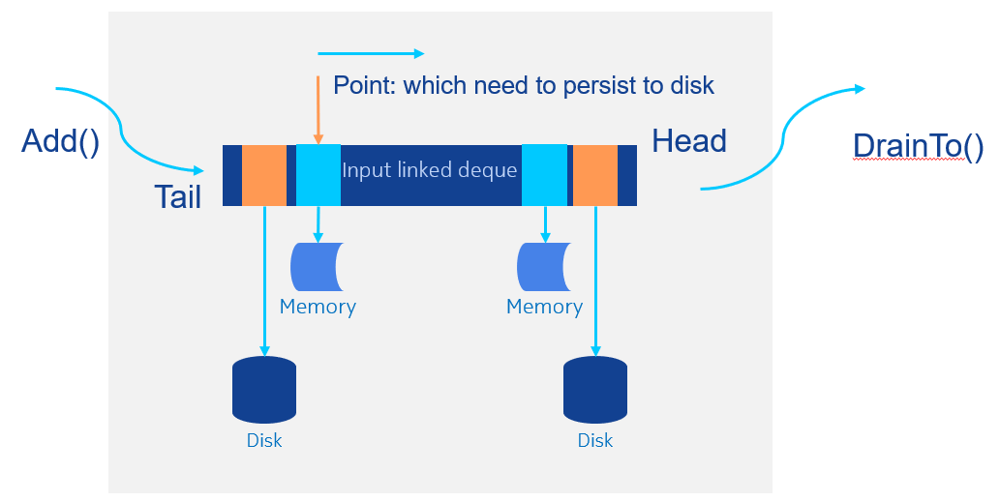
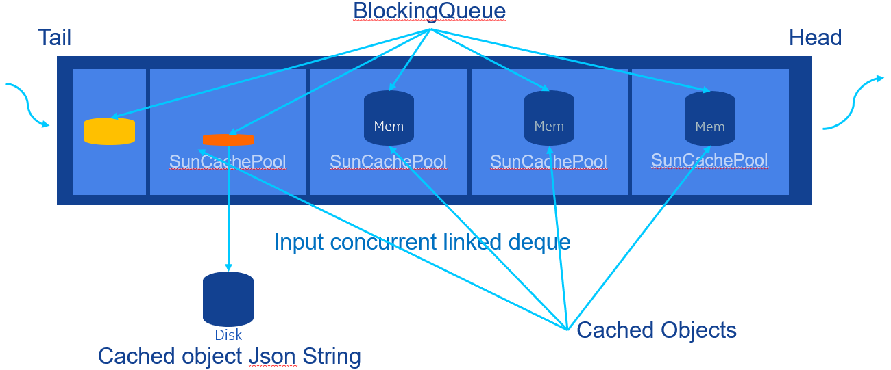

# DiskQueue
A high performance Java queue to use both memory and disk, use disk to cache data when memory is limit, then can support huge cache when memory is small, and can make single system support high performance.

## Problem
Usually we met this situation, the subsystem need to support hugh requests and need to response in a short time, but the memory is limited, and can not to cache much data in memory.
This DiskQueue can use disk to cache data when memory is full.

## Functions
- Support memory heap and disk two level storage;
- Memory first, if exceed memory then use disk;
- Disk storage will split to multiple files, each files contains “pagesize” number objects;
- Objects disk stored as json string;
- Support FIFO(first input first output);
- When the disk stored data loaded to memory, then the disk file will be removed, that means only one copy in memory or disk;

## Architecture
- Storage


- Storage structure


## Usage

### Example
Test codes:
```
public void test(){
        DiskCache<Integer> queue = new DiskCache<>("test", Integer.class, 60, 20, 1000, true, "./testqueue");

        for(int i=0; i<50; i++) {
            queue.add(i);
        }
        ArrayList<Integer> list = new ArrayList<>();

        queue.drainTo(list, 20);
        System.out.println(list);
        list.clear();

        queue.drainTo(list, 20);
        System.out.println(list);
        list.clear();

        queue.drainTo(list, 20);
        System.out.println(list);
        list.clear();
    }
```
Output:
```
[0, 1, 2, 3, 4, 5, 6, 7, 8, 9, 10, 11, 12, 13, 14, 15, 16, 17, 18, 19]
[20, 21, 22, 23, 24, 25, 26, 27, 28, 29, 30, 31, 32, 33, 34, 35, 36, 37, 38, 39]
[40, 41, 42, 43, 44, 45, 46, 47, 48, 49]

```

## Performance test result
### Use heap memory only
Heap is enough: read speed = write speed
Capacity: 1000000, HeapCapacity: 500000, DiskPageSize: 1000

- Total: 1200001

Capacity: 1000000, HeapCapacity: 500000, DiskPageSize: 1000, Size: 1, Heap: 1, InPool: 1, OutPool: 0, PersistedFiles: 0, LoadFromDisk: 0, diskFiles: 0, Write speed: 200200 /s

Capacity: 1000000, HeapCapacity: 500000, DiskPageSize: 1000, Size: 197000, Heap: 197000, InPool: 197, OutPool: 0, PersistedFiles: 0, LoadFromDisk: 0, diskFiles: 0, getted: 1203000, BatchSize: 1000,Read speed: 201798 /s

- Total: 1400001

Capacity: 1000000, HeapCapacity: 500000, DiskPageSize: 1000, Size: 1, Heap: 1, InPool: 1, OutPool: 0, PersistedFiles: 0, LoadFromDisk: 0, diskFiles: 0, Write speed: 200200 /s

Capacity: 1000000, HeapCapacity: 500000, DiskPageSize: 1000, Size: 195000, Heap: 195000, InPool: 195, OutPool: 0, PersistedFiles: 0, LoadFromDisk: 0, diskFiles: 0, getted: 1405000, BatchSize: 1000,Read speed: 201798 /s

### Disk cache used
Used disk cache: read speed < write speed
Capacity: 1000000, HeapCapacity: 500000, DiskPageSize: 1000

- Total: 9900001

Capacity: 1000000, HeapCapacity: 500000, DiskPageSize: 1000, Size: 983001, Heap: 498001, InPool: 984, OutPool: 0, PersistedFiles: 3162, LoadFromDisk: 2677, diskFiles: 485, Write speed: 301175 /s

Capacity: 1000000, HeapCapacity: 500000, DiskPageSize: 1000, Size: 1000000, Heap: 499000, InPool: 1000, OutPool: 0, PersistedFiles: 3178, LoadFromDisk: 2677, diskFiles: 501, getted: 6648000, BatchSize: 1000,Read speed: 182634 /s

- Total: 10200001

Capacity: 1000000, HeapCapacity: 500000, DiskPageSize: 1000, Size: 964477, Heap: 497477, InPool: 965, OutPool: 0, PersistedFiles: 3240, LoadFromDisk: 2773, diskFiles: 467, Write speed: 300300 /s

Capacity: 1000000, HeapCapacity: 500000, DiskPageSize: 1000, Size: 1000000, Heap: 499000, InPool: 1000, OutPool: 0, PersistedFiles: 3274, LoadFromDisk: 2773, diskFiles: 501, getted: 6871000, BatchSize: 1000,Read speed: 222554 /s

